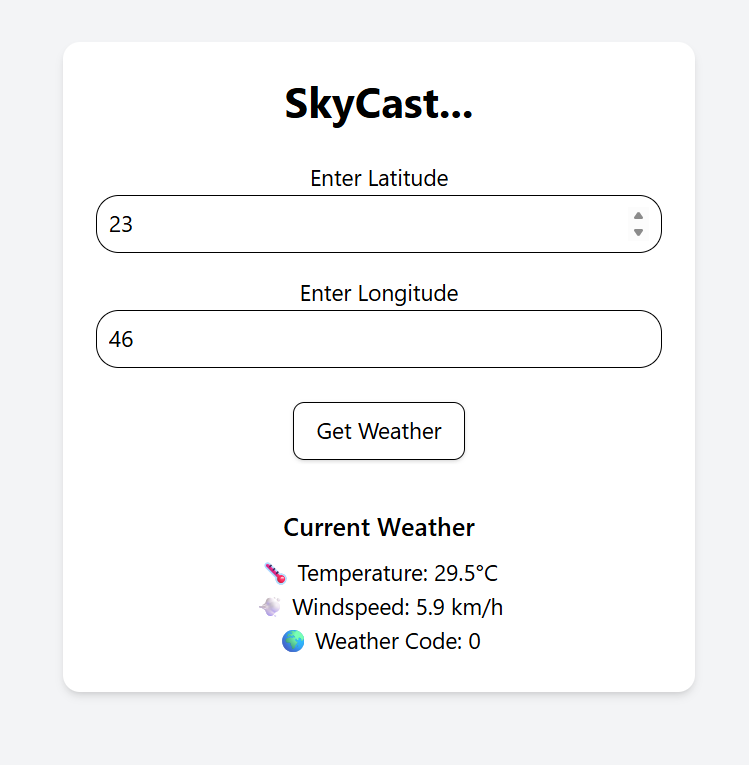

# 🌤️ SkyCast – React Weather App

SkyCast is a simple weather application built with React and Vite. It allows users to input latitude and longitude to fetch real-time weather data using the Open-Meteo API. This project was built to practice React fundamentals and explore API integration with a clean, responsive UI.

---

## 🚀 Features

- Input latitude and longitude
- Fetch and display current temperature, windspeed, and weather code
- Built with React (`useState`, `useEffect`, props)
- Styled using Tailwind CSS
- Handles loading and error states

---

## 🛠️ Tech Stack

- React
- Vite
- Tailwind CSS
- Open-Meteo API

---

## 📦 Installation

```bash
git clone https://github.com/thrisha-burra23/skycast.git
cd skycast
npm install
npm run dev
```


## ▶️ How to Use

1. Open the app in your browser after running `npm run dev`.
2. Enter a **latitude** and **longitude** in the input fields.
3. Click the **"Get Weather"** button.
4. View the current weather details:
   - 🌡️ Temperature (°C)
   - 💨 Windspeed (km/h)
   - 🌍 Weather Code

---

## 🌐 Live Demo

🔗 [SkyCast on GitHub Pages](https://thrisha-burra23.github.io/skycast)

---

## 🖼️ Screenshot




---

## 📬 Feedback

Feel free to fork, star, or open issues. Contributions are welcome!


